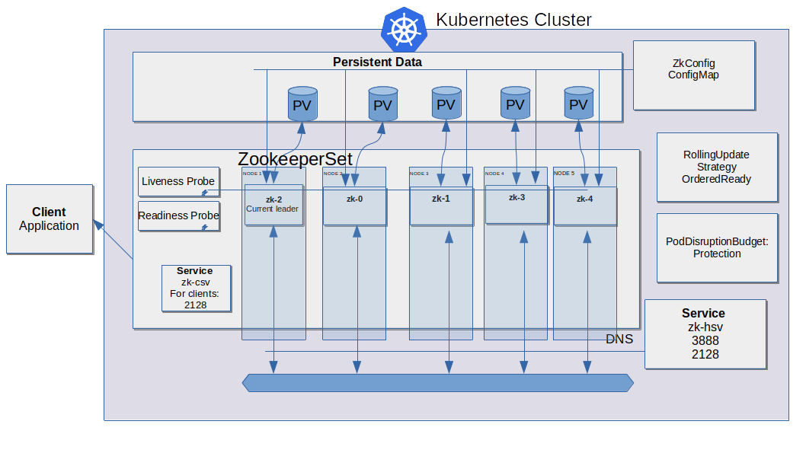
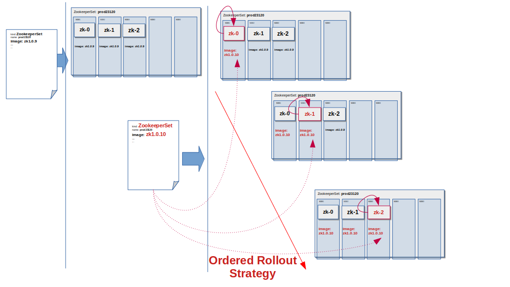
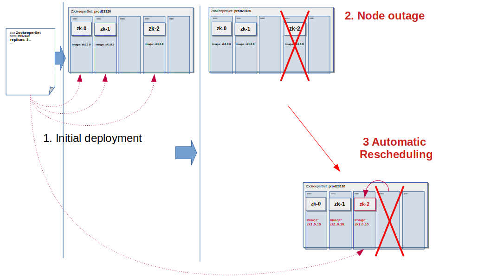

# ZookeeperSet - operator

## Overview

The Zookeeperset Operator deploys a zookeeper cluster and automatically operates the cluster.

The Operator implements:

1. High Availability (HA)
    - instance distribution to different nodes
    - automatic recovery for zookeeper instances
    - Quorum Protection (Maintenance Fault Protection)
    - liveness/health checks for instances
2. Data Persistance
3. Automatic network setup
4. Seameless upgrades/rollout with no disruption
5. Full Lifecycle management of the zookeeper cluster: 
    - automatic cluster deployment
    - autoconfiguration during cluster deployment
    - minor version upgrades for the cluster
    - instance specific configuration using instance image logic
    - instance specific secrets using instance image logic
6. Rollback support for image upgrades


## Cluster Setup 





## Basic Configuration

The ZookeeperSet deploys SERVERS="replicas" number of instances.

$SERVERS is available at start time for all instances .

All zookeeper instances receive hostnames to be zk-{$ORD} (like zk-0, zk-1 ) where $ORD is 0..$SERVERS-1.
All zookeeper instances have the same local dns domain.
The instances can access the host name and the domain in the following way:
```
HOST=`hostname -s`
DOMAIN=`hostname -d`  # identical for all
```
With this values the image can construct the zookeeper config file. 


## Ordered Automatic Rollout



## Deploying the Operator

```
# deploy the latest version 
make deploy
# alternatively a specific version: 
# make docker-build docker-push deploy IMAGE_TAG_BASE='jankul02/zookeeperset' VERSION='0.0.151" 
```
check if the operator is running:
```
kubectl get pods -n zookeeperset-system
kubectl logs zookeeperset-controller-manager-6dcd55bf77-xj2rj -n zookeeperset-system manager

```

### Deploy a ZookeeperSet (Basics)

Create the resource definitions (a ZookeeperSet CR) 

A file like zookeeperset-lab.yaml:

```yaml
apiVersion: dataproxy.jankul02/v1alpha1
kind: ZookeeperSet
metadata:
  name: zookeeperset-lab
  namespace: default
spec:
  replicas: 3
  app: "zk"
  image: jankul02/kubernetes-zookeeper:0.0.25
  data:
    cfg: |
      LOG_LEVEL=INFO
      WELCOME_MESSAGE="Hey Hey for all"
      ADDITIONAL_PARAM=" Value"
```

Apply the CR defintion.

```
kubectl apply -f zookeeperset-lab.yaml

# observe the deployment
kubectl get pods -w 

```

## Showcases

Assumed:

1. 4 nodes cluster (minikube start --nodes 4)
2. 3 zookeeper replicas (replicas: 3)

### Network setup
#### Show myid files:
```
for i in 0 1 2; do echo "myid zk-$i";kubectl exec zk-$i -- cat /var/lib/zookeeper/data/myid; done
```

#### Show fqdn

```
for i in 0 1 2; do kubectl exec zk-$i -- hostname -f; done
```

### functional case: write to zk-0 and get it back from zk-1
```
kubectl exec zk-0 zkCli.sh create /mykey "hello world"

kubectl exec zk-1 zkCli.sh get /mykey

# kubectl exec zk-0 -- zookeeper-shell localhost:2181 create /mykey "Hello World"

```

## HA

### Recovering from a failure:
RestartPolicy=Always
```
kubectl exec zk-0 -- ps -ef

kubectl exec zk-0 -- pkill java

kubectl get pod -w -l 

```

### Liveness
remove the check to force fail the check
```
kubectl exec zk-0 -- rm /etc/confluent/docker/zookeeper-ready
kubectl get pod -w  
```

### Deployment: No Single Point of Failure

Instances are automatically deployed on different nodes of the cluster
There is no collocation on one node
affinity / antiaffinity settings

```
for i in 0 1 2; do kubectl get pod zk-$i --template {{.spec.nodeName}}; echo ""; done
```

### Protection against Node outage



```
kubectl get pdb zk-pdb
# show the pod/node assoc
for i in 0 1 2; do kubectl get pod zk-$i --template {{.spec.nodeName}}; echo ""; done
# drain zk-2 node
kubectl drain $(kubectl get pod zk-2 --template {{.spec.nodeName}}) --ignore-daemonsets --force --delete-emptydir-data

kubectl get pods -w -l # watch

# kubectl drain succeeds and the zk-2 is rescheduled to another node
```


### Protection against maintenance failures

Disruption protection:

```
kubectl get pdb zk-pdb
# show the pod/node assoc
for i in 0 1 2; do kubectl get pod zk-$i --template {{.spec.nodeName}}; echo ""; done
# drain zk-0 node
kubectl drain $(kubectl get pod zk-0 --template {{.spec.nodeName}}) --ignore-daemonsets --force --delete-emptydir-data

kubectl get pods -w -l # watch


# kubectl drain succeeds and the zk-0 is rescheduled to another node


# drain another node
kubectl drain $(kubectl get pod zk-1 --template {{.spec.nodeName}}) --ignore-daemonsets --force --delete-emptydir-data "kubernetes-node-ixsl" cordoned

kubectl get pods -w -l # watch
# drain again 
kubectl drain $(kubectl get pod zk-2 --template {{.spec.nodeName}}) --ignore-daemonsets --force --delete-emptydir-data

# drain will be refused


# check zookeeper still working 
kubectl exec zk-0 zkCli.sh get /mykey

# uncordon
kubectl uncordon node-1231 

```

## Deployment and configuration

### Deployment

Change the image name in the zookeeperset resource file and then apply it and observe

```
kubectl apply -f config/samples/dataproxy_v1alpha1_zookeeperset.yaml

kubectl get pods -w -l # to observe the rollout 
```

### Instance Configuration
 
1. change Configuration of the zk-2 instance in the zookeeperset resource file

```
kubectl apply -f config/samples/dataproxy_v1alpha1_zookeeperset.yaml

kubectl get pods -w -l # to observe the restart zk-2 only 

# view the beginning of the log 
kubectl logs zk-2

```

# Helpful oneliners

### Build, push, deploy the operator 
```
make docker-build docker-push deploy VERSION=0.0.38
```

### create a zookeeperset from sample 
```
kubectl apply -f config/samples/dataproxy_v1alpha1_zookeeperset.yaml

kubectl get pods -A

kubectl logs zookeeperset-controller-manager-6dcd55bf77-5pqps -n zookeeperset-system manager
```
### delete the zookeeperset created from sample 
```
kubectl delete -f config/samples/dataproxy_v1alpha1_zookeeperset.yaml
```

### undeploy the zookeeperset operator 
```
make undeploy
```

## Advanced Configuration

The defaults for all instances ("global") are by defined under:
```yaml
data:
    cfg: |
      LOG_LEVEL=INFO
      WELCOME_MESSAGE="Hey Hey for all"
      ADDITIONAL_PARAM=" Value"
``` 
and will be mounted under:
```
/mnt/zk-global
```

By conventions the instance specific configuration should be named ${ORD}-1 and specified under spec.data like

```yaml
  spec:
    data:
      ZOOKEEPER_TOOLS_LOG4J_LOGLEVEL=DEBUG
      ZOOKEEPER_LOG4J_ROOT_LOGLEVEL=DEBUG
      WELCOME_MESSAGE="Hey Hey for all"
      ADDITIONAL_PARAM=" Value"
    0: |
      ZOOKEEPER_TOOLS_LOG4J_LOGLEVEL=INFO
      ZOOKEEPER_LOG4J_ROOT_LOGLEVEL=INFO
      WELCOME_MESSAGE="Hula hop hej hej 0"
      ADDITIONAL_PARAM=" 231122"
    2: |
      ZOOKEEPER_TOOLS_LOG4J_LOGLEVEL=WARN
      ZOOKEEPER_LOG4J_ROOT_LOGLEVEL=WARN
      WELCOME_MESSAGE="Hi Hi Ho 2"
      ADDITIONAL_PARAM=" 23134122" 
```
The configuration will be mounted as a file with the name of ${ORD}-1 under /mnt/zk-global/:
```
cat /mnt/zk-config/0 | grep WELCOME_MESSAGE
WELCOME_MESSAGE="Hula hop hej hej 0"
```

It is the responisibility of the instance to use the needed configuration in a secure way (like avoiding shell sourcing). 

By conventions the instance specific secrets should be named zksecrets for common secrets and zksecrets0, zksecrets1 ... for instance specific secrets  and specified under spec.data like:
```yaml
spec:
  secrets:
  - secretname: zksecrets
    items:
    - key: username
      path: zksecrets 
    - key: password
      path: zksecrets 
  - secretname: zksecrets0
    items:
    - key: username
      path: zksecrets0 
    - key: password
      path: zksecrets0 
```
The secrets will be mounted as files with the name as their secretname under /mnt/:
```
ls /mnt/zksecrets0
```

## Advanced Configuration Deployment

Create resource definitions:

- all needed secrets
- a ZookeeperSet CR 

zksecrets.yaml
```yaml
apiVersion: v1
kind: Secret
metadata:
  name: zksecrets
  namespace: default
  labels:
    app: zk
type: Opaque
data:
  username: YWRtaW4=
  password: ZGZhcXFkcXFhcXEzNDUyOA==  
```
zksecrets2.yaml 
```yaml
apiVersion: v1
kind: Secret
metadata:
  name: zksecrets2
  namespace: default
  labels:
    app: zk
type: Opaque
data:
  username: YWRtaW4=
  password: YXFxZHFxYXFxMzQ1Mjg=
  api: aHR0cHM6Ly9hcGkuZXhhbXBsZS5jb20=
```

zksecrets0.yaml
```yaml
apiVersion: v1
kind: Secret
metadata:
  name: zksecrets0
  namespace: default
  labels:
    app: zk
type: Opaque
data:
  username: YWRtaW4=
  password: MWYyZDFlMmU2N2Rm
```

 and a file like zookeeperset-lab.yaml
```yaml
apiVersion: dataproxy.jankul02/v1alpha1
kind: ZookeeperSet
metadata:
  name: zookeeperset-lab
  namespace: default
spec:
  replicas: 3
  app: "zk"
  image: jankul02/kubernetes-zookeeper:0.0.25
  data:
    cfg: |
      ZOOKEEPER_TOOLS_LOG4J_LOGLEVEL=DEBUG
      ZOOKEEPER_LOG4J_ROOT_LOGLEVEL=DEBUG
      WELCOME_MESSAGE="Hey Hey for all"
      ADDITIONAL_PARAM=" Value"
    0: |
      ZOOKEEPER_TOOLS_LOG4J_LOGLEVEL=INFO
      ZOOKEEPER_LOG4J_ROOT_LOGLEVEL=INFO
      WELCOME_MESSAGE="Hula hop hej hej 0"
      ADDITIONAL_PARAM=" 231122"
    2: |
      ZOOKEEPER_TOOLS_LOG4J_LOGLEVEL=WARN
      ZOOKEEPER_LOG4J_ROOT_LOGLEVEL=WARN
      WELCOME_MESSAGE="Hi Hi Ho 2"
      ADDITIONAL_PARAM=" 23134122" 
  secrets:
  - secretname: zksecrets
    items:
    - key: username
      path: zksecrets 
    - key: password
      path: zksecrets 
  - secretname: zksecrets0
    items:
    - key: username
      path: zksecrets0 
    - key: password
      path: zksecrets0 
  - secretname: zksecrets2
    items:
    - key: username
      path: zksecrets2
    - key: password              
      path: zksecrets2
    - key: api              
      path: zksecrets2
```

Deploy the secrets and the ZookeeperSet
```
kubectl apply -f zksecrets.yaml
kubectl apply -f zksecrets0.yaml
kubectl apply -f zksecrets2.yaml


kubectl apply -f zookeeperset-lab.yaml

# observe the deployment
kubectl get pods -w 

```

## Scaling **not implemented**

(Re)scalling is **not implemented** and there is no protection against changing the value of replicas.
The results of scalling are unknown and currently unpredictable.


```
#cert manager
curl -L -o kubectl-cert-manager.tar.gz https://github.com/jetstack/cert-manager/releases/latest/download/kubectl-cert_manager-linux-amd64.tar.gz
tar xzf kubectl-cert-manager.tar.gz
sudo mv kubectl-cert_manager /usr/local/bin

kubectl cert-manager x install
````

kubectl delete pvc datadir-0-kafka-0 datadir-0-kafka-1 datadir-0-kafka-2 datadir-zk-0 datadir-zk-1 datadir-zk-2 datalogdir-zk-0 datalogdir-zk-1 datalogdir-zk-2


```
keytool -keystore server.keystore.jks -alias localhost -validity 5555 -genkey -keyalg RSA -ext SAN=DNS:{FQDN}


1. Deploy a zookeeper client pod with configuration:

    apiVersion: v1
    kind: Pod
    metadata:
      name: zookeeper-client
      namespace: default
    spec:
      containers:
      - name: zookeeper-client
        image: confluentinc/cp-zookeeper:6.1.0
        command:
          - sh
          - -c
          - "exec tail -f /dev/null"

2. Log into the Pod

  kubectl exec -it zookeeper-client -- /bin/bash

3. Use zookeeper-shell to connect in the zookeeper-client Pod:

  zookeeper-shell zk-hs:2181

4. Explore with zookeeper commands, for example:

  # Gives the list of active brokers
  ls /brokers/ids

  # Gives the list of topics
  ls /brokers/topics

  # Gives more detailed information of the broker id '0'
  get /brokers/ids/0## ------------------------------------------------------
## Kafka
## ------------------------------------------------------
To connect from a client pod:

1. Deploy a kafka client pod with configuration:

    apiVersion: v1
    kind: Pod
    metadata:
      name: kafka-client
      namespace: default
    spec:
      containers:
      - name: kafka-client
        image: confluentinc/cp-enterprise-kafka:6.1.0
        command:
          - sh
          - -c
          - "exec tail -f /dev/null"

2. Log into the Pod

  kubectl exec -it kafka-client -- /bin/bash

3. Explore with kafka commands:

  # Create the topic
  kafka-topics --zookeeper cp-helm-charts-1632213534-cp-zookeeper-headless:2181 --topic cp-helm-charts-1632213534-topic --create --partitions 1 --replication-factor 1 --if-not-exists

  # Create a message
  MESSAGE="`date -u`"

  # Produce a test message to the topic
  echo "$MESSAGE" | kafka-console-producer --broker-list cp-helm-charts-1632213534-cp-kafka-headless:9092 --topic cp-helm-charts-1632213534-topic

  # Consume a test message from the topic
  kafka-console-consumer --bootstrap-server cp-helm-charts-1632213534-cp-kafka-headless:9092 --topic cp-helm-charts-1632213534-topic --from-beginning --timeout-ms 2000 --max-messages 1 | grep "$MESSAGE"


```
// openssl genrsa -out ca.key
// openssl req -new -x509 -key ca.key -out ca.crt
openssl req -new   -x509  -days 3650  -keyout ca.key  -out ca.crt   -subj "/C=DE/L=Munich/CN=Certificate Authority" 
Generating a RSA private key
............................+++++
.......................+++++
writing new private key to 'ca.key'
-----
```

```
san=dns:kafka-0.default.svc.cluster.local,dns:test.example.net,dns:test2.example.com,ip:XX.XXX.XX.XXX

 2219  keytool -genkey -keystore server.keystore.kafka-0 -alias localhost -dname CN=kafka-0.default.svc.cluster.local -keyalg RSA -validity 3650  -ext san=dns:kafka-0
 2221  keytool -genkey -keystore server.keystore.kafka-1 -alias localhost -dname CN=kafka-1.default.svc.cluster.local -keyalg RSA 
 2222  keytool -genkey -keystore server.keystore.kafka-2 -alias localhost -dname CN=kafka-2.default.svc.cluster.local -keyalg RSA 
 2223  keytool -genkey -keystore server.keystore.zk-0 -alias localhost -dname CN=zk-0.default.svc.cluster.local -keyalg RSA -validity 3650  -ext san=dns:zk-0
 2224  keytool -genkey -keystore server.keystore.zk-1 -alias localhost -dname CN=zk-1.default.svc.cluster.local -keyalg RSA -validity 3650  -ext san=dns:zk-1
 2225  keytool -genkey -keystore server.keystore.zk-2 -alias localhost -dname CN=zk-2.default.svc.cluster.local -keyalg RSA -validity 3650  -ext san=dns:zk-2
 2226  keytool -genkey -keystore server.keystore.zk-client-0 -alias localhost -dname CN=zk-client-0.default.svc.cluster.local -keyalg RSA -validity 3650  -ext san=dns:zk-client-0
 2227  keytool -genkey -keystore server.keystore.kafka-client-0 -alias localhost -dname CN=kafka-client-0.default.svc.cluster.local -keyalg RSA -validity 3650  -ext san=dns:kafka-client-0


keytool -keystore server.keystore.zk-client-0 -alias CARoot -importcert -file ca.crt  --storepass ********* -noprompt
keytool -keystore server.keystore.kafka-client-0 -alias CARoot -importcert -file ca.crt --storepass ********* -noprompt
keytool -keystore server.keystore.kafka-0 -alias CARoot -importcert -file ca.crt --storepass ********* -noprompt
keytool -keystore server.keystore.kafka-1 -alias CARoot -importcert -file ca.crt --storepass ********* -noprompt
keytool -keystore server.keystore.kafka-2 -alias CARoot -importcert -file ca.crt --storepass ********* -noprompt
keytool -keystore server.keystore.zk-0 -alias CARoot -importcert -file ca.crt --storepass ********* -noprompt
keytool -keystore server.keystore.zk-1 -alias CARoot -importcert -file ca.crt --storepass ********* -noprompt
keytool -keystore server.keystore.zk-2 -alias CARoot -importcert -file ca.crt --storepass ********* -noprompt


 2244  keytool -keystore server.keystore.kafka-0 -alias localhost -certreq -file cert-file-kafka-0
 2245  keytool -keystore server.keystore.kafka-1 -alias localhost -certreq -file cert-file-kafka-1
 2246  keytool -keystore server.keystore.kafka-2 -alias localhost -certreq -file cert-file-kafka-2
 2247  keytool -keystore server.keystore.zk-2 -alias localhost -certreq -file cert-file-zk-2
 2248  keytool -keystore server.keystore.zk-1 -alias localhost -certreq -file cert-file-zk-1
 2249  keytool -keystore server.keystore.zk-0 -alias localhost -certreq -file cert-file-zk-0
 2250  keytool -keystore server.keystore.zk-client-0 -alias localhost -certreq -file cert-file-zk-client-0
 2251  keytool -keystore server.keystore.kafka-client-0 -alias localhost -certreq -file cert-file-kafka-client-0


 2253  openssl x509 -req -CA ca.crt -CAkey ca.key -in cert-file-kafka-0 -out cert-signed-kafka-0 -days 3650 -CAcreateserial pass:tapowa01
 2254  openssl x509 -req -CA ca.crt -CAkey ca.key -in cert-file-kafka-0 -out cert-signed-kafka-0 -days 3650 -CAcreateserial -passin pass:tapowa01
 2255  openssl x509 -req -CA ca.crt -CAkey ca.key -in cert-file-kafka-1 -out cert-signed-kafka-1 -days 3650 -CAcreateserial -passin pass:tapowa01
 2256  openssl x509 -req -CA ca.crt -CAkey ca.key -in cert-file-kafka-2 -out cert-signed-kafka-2 -days 3650 -CAcreateserial -passin pass:tapowa01
 2257  openssl x509 -req -CA ca.crt -CAkey ca.key -in cert-file-zk-2 -out cert-signed-zk-2 -days 3650 -CAcreateserial -passin pass:tapowa01
 2258  openssl x509 -req -CA ca.crt -CAkey ca.key -in cert-file-zk-1 -out cert-signed-zk-1 -days 3650 -CAcreateserial -passin pass:tapowa01
 2259  openssl x509 -req -CA ca.crt -CAkey ca.key -in cert-file-zk-0 -out cert-signed-zk-0 -days 3650 -CAcreateserial -passin pass:tapowa01
 2260  openssl x509 -req -CA ca.crt -CAkey ca.key -in cert-file-zk-client-0 -out cert-signed-zk-client-0 -days 3650 -CAcreateserial -passin pass:tapowa01
 2261  openssl x509 -req -CA ca.crt -CAkey ca.key -in cert-file-kafka-client-0 -out cert-signed-kafka-client-0 -days 3650 -CAcreateserial -passin pass:tapowa01
```


keytool -keystore server.keystore.kafka-0 -alias CARoot -importcert -file ca.crt
keytool -keystore server.keystore.kafka-0  -alias localhost -importcert -file cert-signed-kafka-0

################
```
janusz@janusz-strix:~/projects/zookeeperset/kafka-tls$ keytool -genkey -keystore server.keystore.zk-0 -alias localhost -dname CN=zk-0.default.svc.cluster.local -keyalg RSA -validity 3650  -ext san=dns:zk-0
Enter keystore password:  
Re-enter new password: 
Generating 2,048 bit RSA key pair and self-signed certificate (SHA256withRSA) with a validity of 3,650 days
        for: CN=zk-0.default.svc.cluster.local
janusz@janusz-strix:~/projects/zookeeperset/kafka-tls$ keytool -genkey -keystore server.keystore.zk-1 -alias localhost -dname CN=zk-1.default.svc.cluster.local -keyalg RSA -validity 3650  -ext san=dns:zk-1
Enter keystore password:  
Re-enter new password: 
Generating 2,048 bit RSA key pair and self-signed certificate (SHA256withRSA) with a validity of 3,650 days
        for: CN=zk-1.default.svc.cluster.local
janusz@janusz-strix:~/projects/zookeeperset/kafka-tls$ keytool -genkey -keystore server.keystore.zk-2 -alias localhost -dname CN=zk-2.default.svc.cluster.local -keyalg RSA -validity 3650  -ext san=dns:zk-2
Enter keystore password:  
Re-enter new password: 
Generating 2,048 bit RSA key pair and self-signed certificate (SHA256withRSA) with a validity of 3,650 days
        for: CN=zk-2.default.svc.cluster.local

janusz@janusz-strix:~/projects/zookeeperset/kafka-tls$ keytool -keystore server.keystore.zk-0 -alias localhost -certreq -file cert-file-zk-0
Enter keystore password:  
janusz@janusz-strix:~/projects/zookeeperset/kafka-tls$ keytool -keystore server.keystore.zk-1 -alias localhost -certreq -file cert-file-zk-1
Enter keystore password:  
janusz@janusz-strix:~/projects/zookeeperset/kafka-tls$ keytool -keystore server.keystore.zk-2 -alias localhost -certreq -file cert-file-zk-2
Enter keystore password:  

janusz@janusz-strix:~/projects/zookeeperset/kafka-tls$ openssl x509 -req -CA ca.crt -CAkey ca.key -in cert-file-zk-0 -out cert-signed-zk-0 -days 3650 -CAcreateserial
Signature ok
subject=CN = zk-0.default.svc.cluster.local
Getting CA Private Key
Enter pass phrase for ca.key:
janusz@janusz-strix:~/projects/zookeeperset/kafka-tls$ openssl x509 -req -CA ca.crt -CAkey ca.key -in cert-file-zk-1 -out cert-signed-zk-1 -days 3650 -CAcreateserial
Signature ok
subject=CN = zk-1.default.svc.cluster.local
Getting CA Private Key
Enter pass phrase for ca.key:
janusz@janusz-strix:~/projects/zookeeperset/kafka-tls$ openssl x509 -req -CA ca.crt -CAkey ca.key -in cert-file-zk-2 -out cert-signed-zk-2 -days 3650 -CAcreateserial
Signature ok
subject=CN = zk-2.default.svc.cluster.local
Getting CA Private Key
Enter pass phrase for ca.key:
```


create secrets for the key stores
```
printf "" > keystores.base64.secret.yaml; for KEYST in zk-0 zk-1 zk-2 kafka-0 kafka-1 kafka-2 kafka-client-0 zk-client-0
do
cat server.keystore.${KEYST} | base64 -w0 > server.keystore.${KEYST}.base64  
cat << EOF >>keystores.base64.secret.yaml
apiVersion: v1
kind: Secret
metadata:
  name: secret-${KEYST}
  namespace: default
data:
  keystore.jks: "$(cat server.keystore.${KEYST}.base64)"
---
EOF
done
kubectl apply -f keystores.base64.secret.yaml

```